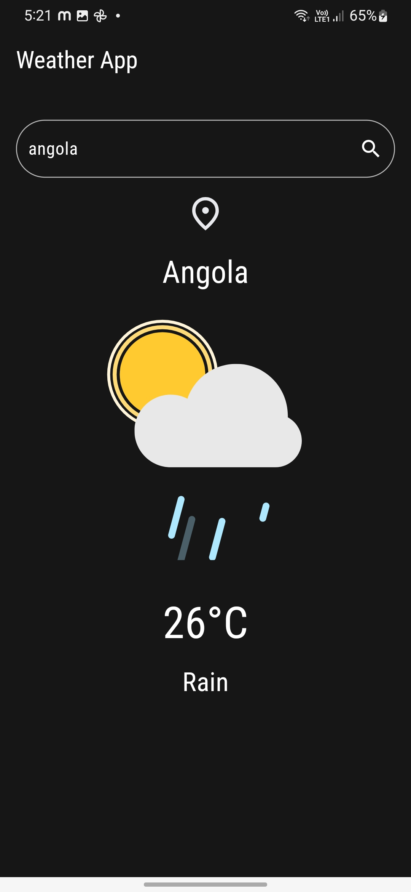
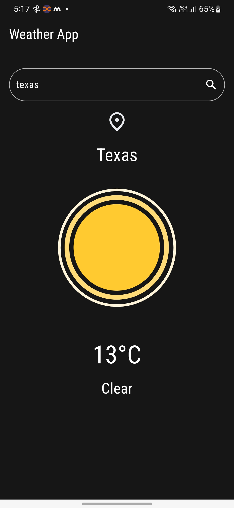
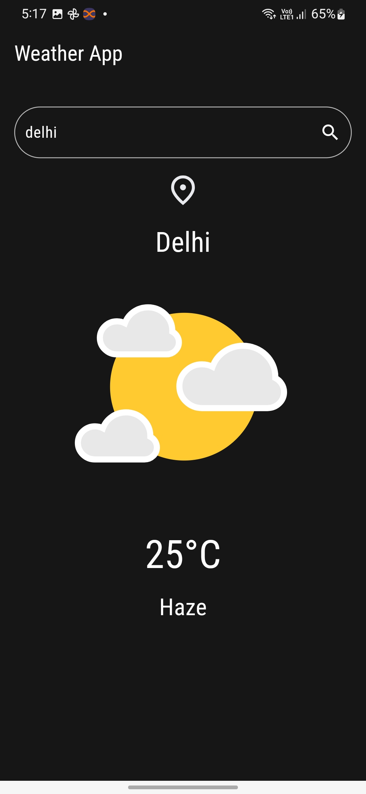

# Minimal Weather App 🌦️  

A sleek and minimalistic weather app built with Flutter that provides real-time temperature and climate information. By default, the app shows the weather conditions of your current location. Additionally, users can search for weather updates of any city around the world.  

---

## **Features**  

- **Current Location Weather**: Automatically fetches and displays the temperature and climate of the user's current city.  
- **Search for Any City**: Users can input the name of a city to get its current weather conditions.  
- **Dynamic Animations**: Lottie animations dynamically represent weather conditions such as sunny, cloudy, or rainy weather.  
- **Responsive UI**: A visually appealing design that adapts seamlessly to various devices.  

---

## **Tech Stack**  

- **Framework**: Flutter  
- **API**: [OpenWeatherMap API](https://openweathermap.org/)  
- **Animations**: [Lottie Files](https://lottiefiles.com/)  

---

## **Screenshots**  
 
|  |
|  |
|  |
|  |

---

## **Getting Started**  

### **Prerequisites**  

- Flutter SDK installed ([installation guide](https://docs.flutter.dev/get-started/install)).  
- An OpenWeatherMap API key ([get yours here](https://openweathermap.org/appid)).  

---

### **Setup Instructions**  

1. Clone the repository:  
   ```bash  
   git clone https://github.com/your-username/minimal-weather-app.git  
   cd minimal-weather-app  
   ```  

2. Install dependencies:  
   ```bash  
   flutter pub get  
   ```  

3. Add your OpenWeatherMap API key:  
   Replace the placeholder API key in `WeatherService` class with your actual API key.  

4. Run the application:  
   ```bash  
   flutter run  
   ```  

---

## **How It Works**  

1. The app requests location permissions to fetch the user's current city using geolocation services.  
2. The weather data is retrieved via the OpenWeatherMap API.  
3. Users can input the name of a city in the search bar to view its weather details.  
4. Animated weather conditions are displayed using Lottie files, enhancing the user experience.  

---

## **Dependencies Used**  

- **[Geolocator](https://pub.dev/packages/geolocator)**: For fetching the user's current location.  
- **[http](https://pub.dev/packages/http)**: For making API requests to OpenWeatherMap.  
- **[Lottie](https://pub.dev/packages/lottie)**: For beautiful weather animations.  
- **[Flutter SVG](https://pub.dev/packages/flutter_svg)**: For rendering scalable vector graphics.  

---

## **Future Enhancements**  

- Add a 7-day weather forecast feature.  
- Introduce dark and light themes for better UI adaptability.  
- Allow users to save favorite cities for quick weather checks.  

---

## **Contributions**  

Contributions are welcome! Feel free to open issues or submit pull requests to improve this app.  

---


## **Acknowledgments**  

- Weather data provided by [OpenWeatherMap](https://openweathermap.org/).  
- Animations by [LottieFiles](https://lottiefiles.com/).  

---

### **Let's Connect!**  

If you find this project useful, consider giving it a ⭐ on GitHub!  
